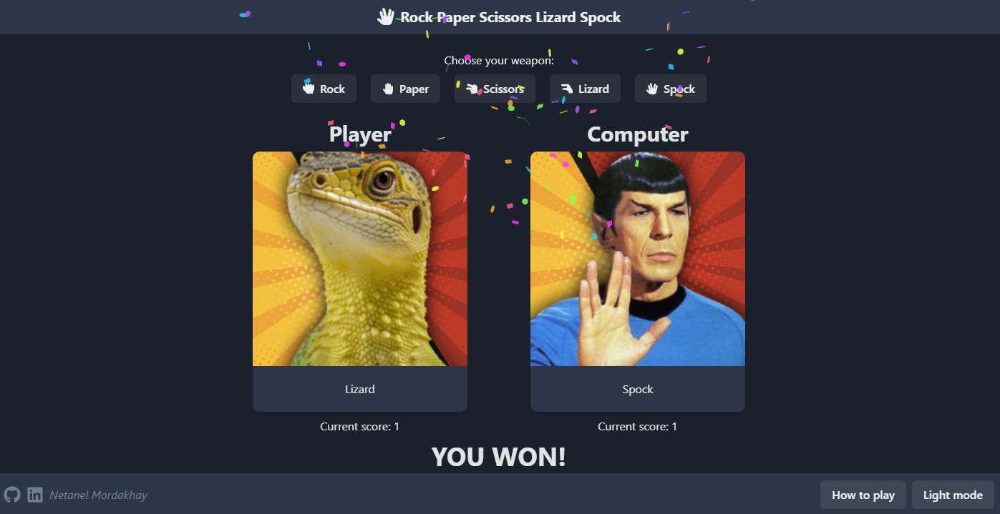

# Rock Paper Scissors Lizard Spock


Based on the Big Bang Theory's version of 'Rock Paper Scissors', I present to you: 'Rock Paper Scissors Lizard Spock'. Rules regarding how to play are available both at the bottom of the readme file and in the app itself (bottom-right corner).

## Live demo: [here](https://bigbang-rock-paper-scissors.netlify.app/)

## Installation

**1. Make sure you have [Node.js](https://nodejs.org/) installed.**
**2. Install using git**

```
git clone https://github.com/Netanel-Mordakhay/Rock-Paper-Scissors-Lizard-Spock
cd Rock-Paper-Scissors-Lizard-Spock
```

**3. Install dependencies**

```
npm install
```

**4. Run locally**

```
npm run dev
```

**5. (Optional) Build for production**

```
npm run build
```

**6. (Optional) Preview production build**

```
npm run preview
```

## Technologies Used

- React
- Vite
- Chakra UI
- Howler.js (used for sounds effects)
- Canvas-Confetti (used for... well, confetti effect 😉)

## How to play

- Scissors cuts Paper
- Paper covers Rock
- Rock crushes Lizard
- Lizard poisons Spock
- Spock smashes Scissors
- Scissors decapitates Lizard
- Lizard eats Paper
- Paper disproves Spock
- Spock vaporizes Rock
- (and as it always has) Rock crushes Scissors

[](https://www.youtube.com/watch?v=pIpmITBocfM)
